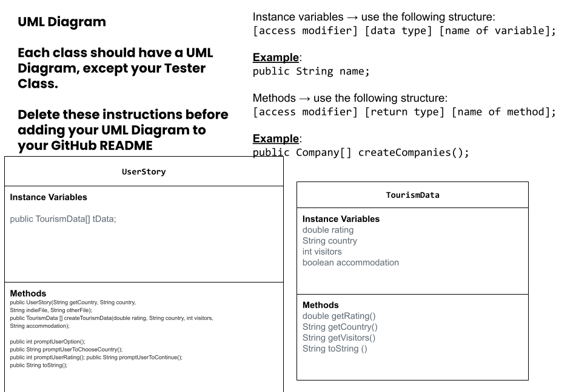

# Unit 3 - Data for Social Good Project 

## Introduction 

Software engineers develop programs to work with data and provide information to a user. Each user has different needs based on the information they are looking for from data. Your goal is to create a data analysis program for your user that stores and analyzes data to provide the information they need. 

## Requirements 

Use your knowledge of object-oriented programming, one-dimensional (1D) arrays, and algorithms to create your data analysis program: 
- **Write a class** – Write a class to represent your user or business and store and analyze their data with no-argument and parameterized constructors. 
- **Create at least two 1D arrays** – Create at least two 1D arrays to store the data that your user needs information about. 
- **Write a method** – Write a method that finds or manipulates the elements in a 1D array to provide the information your user needs. 
- **Implement a toString() method** – Write a toString() method that returns general information about the data (for example, number of values in the dataset). 
- **Document your code** – Use comments to explain the purpose of the methods and code segments and note any preconditions and postconditions. 

## User Story 

> As an [traveling agent],   
> I want to [create a list of ideal travel destinations and important inforgraphics],   
> so that I can [inform others about types of destinations]. 

## Dataset 

Dataset: https://www.kaggle.com/datasets/umeradnaan/tourism-dataset
- **Country** (String) - name of the country 
- **Visitor** (int) - number of people in the country 
- **Rating** (double) - the rating of the area ranging 1-4.5
- **Accomodation** (String) - if the area has accomodations or not 

## UML Diagram 

 

## Description 

Our code gets the information about the tourist travel destinations and display the most and least visited locations. By using 1D arrays of 100 values and 4 different classes, the user receives an element of information from each data structure. The user story relates to the ideal location based on the user input of the rating and accommodation. The user can put in a number 0-4 and a “Yes” or “No” input in order to narrow down the possibilities for the locations that can applied to their needs. By using the increments and decrements of 0.5 the possibilities are narrowed down to meet the users needs. 
